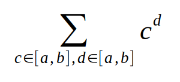

# Седмица 03 - Функции от по-висок ред

## Задача 01 - Композиция
Напишете функция `compose`, която приема две функции на 1 параметър и връща нова функция - тяхната композиция.

### Пример:
```scheme
(define (5+ x)
  (+ x 5))

(define (3* x)
  (* x 3))

((compose 5+ 3*) 4) ; -> 17
```

## Задача 02 - Комбинация
Напишете функция `S`, която приема двуместна функция `f` и едноместна функция `g`. Функцията да връща нова функция, която прима един аргумент `x`, и пресмята `f(x, g(x))`.

### Пример:
```scheme
((S + (lambda (x) (* x x))) 3) ; -> 12
```

## Задача 03 - Curry
Напишете функция `curry`, която приема двуместна функция `f` и я трансформира до функция `g` на един аргумент, връщаща функция на един аргумент, така че `f(a, b) = g(a)(b)`.

### Пример:
```scheme
(((curry +) 5) 7) ; -> 12
((((curry compose) 5+) 3*) 4) ; -> 17
```

## Задача 04 - Многократна композиция
Напишете функция `repeat`, която приема функция `f` и число `n`. Функцията да връща нова функция, която е `n`-кратната композоция на `f`.

### Пример:
```scheme
((repeat (lambda (x) (+ x 1)) 8) 4) ; -> 12
```

## Задача 05 - Производна
Напишете функция `derive`, която приема функция, и връща нейната производна. Използвайте следната формула, като изберете достатъчно малко `h`: 


### Пример:
```scheme
((derive (lambda (x) (* x x))) 4) ; -> 8.000000999430767 при h=0.000001
```

## Функцията `accumulate`
За всяка от следващите задачи използвайте само `accumulate`, без да ползвате пряка рекурсия.
```scheme
(define (accumulate operation null-value begin end term next)
  (if (> begin end) null-value
      (operation (term begin)
                 (accumulate operation null-value (next begin) end term next))))
```

## Задача 06 - Сума на нечетни квадрати
Напишете функция `sum-odd-squares`, която приема 2 числа - `a` и `b`. Функцията да пресмята сумата на нечетните квадрати на числата в интервала [a, b].

### Пример:
```scheme
(sum-odd-squares 1 10) ; -> 165
```

## Задача 07 - Биномен коефициент
Напишете функция `binomial`, която приема 2 числа - `n` и `k`. Функцията да пресмятa $\binom{n}{k}$.

### Пример:
```scheme
(binomial 8 3) ; -> 56
```

## Задача 08 - Максимална стойност
Напишете функция `argmax`, която приема функция `f` и две числа - `a` и `b`. Функцията да намира това число `x` в интервала [a, b], за което f(x) има най-голяма стойност.

### Пример:
```scheme
(argmax (lambda (x) (remainder x 7)) 45 50) ; -> 48
```

## Задача 09 - Истинност
Напишете функция `all?`, която приема предикат и две числа - `a` и `b`. Функцията да проверява дали предиката е истина за всички числа в интервала [a, b].

## Бонус:
Напишете функция `any?`, която е същата като `all?`, но проверява дали `някое` от числата изпълнява предиката.

### Пример:
```scheme
(all? even? 1 10) ; -> #f
(all? (lambda (z) (< z 11)) 1 10) ; -> #t
```

## Задача 10 - Сума на експоненти
Напишете функция `sum-exponents`, която приема две числа - `a` и `b`. Функцията да намира следната сума:



### Пример:
```scheme
(sum-exponents 1 4) ; -> 494
```

## Задача 11 - Седмица 02
Решете задачи 02, 03, 07 от Седмица 02 чрез `accumulate`.